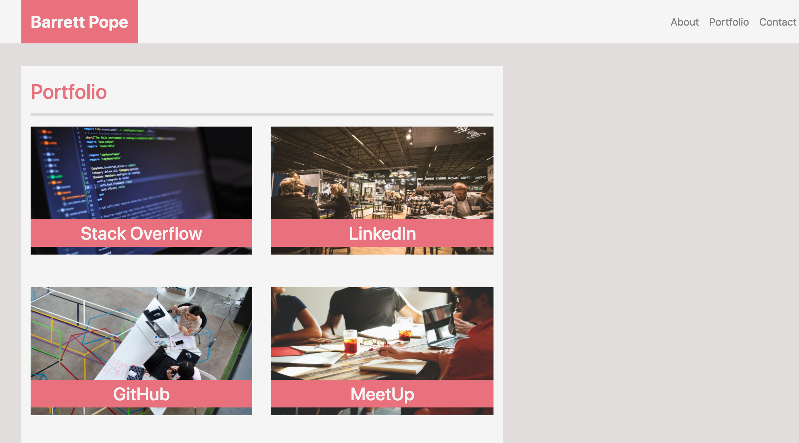
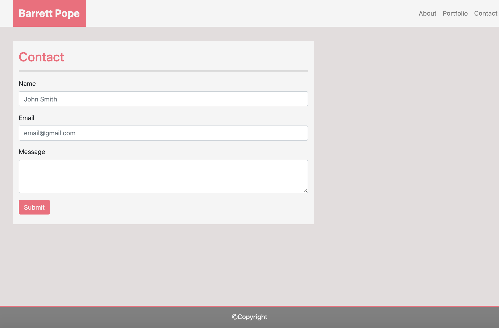

# Responsive-Portfolio

* [Description](#description)
* [Visuals](#visuals)
* [Deployed Application](#deployed)
* [Contributing](#contributing)
* [Support](#support)

## Description 
Responsive-Portfolio is a mobile-first application that utilizes the Bootstrap CSS Framework and, specifically, the grid system. The app features the following pages:
* About Me
* Portfolio
* Contact

## Visuals

## Deployed Application

   
## Contributing
Pull requests are welcome. For major changes, please open an issue first to discuss what you would like to change. 

## Support
For questions, comments or concerns regarding the Responsive-Portfolio application, please email barrettpope94@gmail.com

